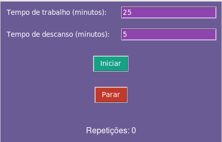
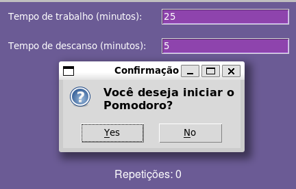
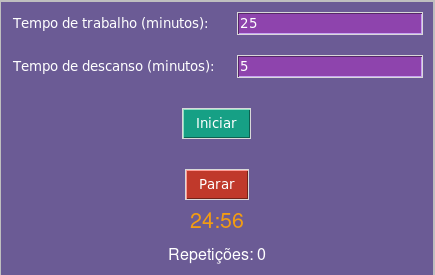
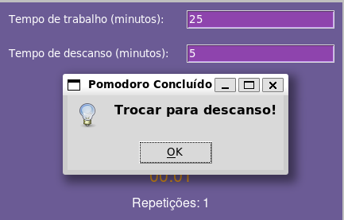

## Pomodoro Count

Temas:
 - Dividir e Conquistar


## Alunos
|Matrícula | Aluno |
| -- | -- |
| 17/0114139  |  Samuel Victor Castro Macêdo |
| 19/0033427  |  Pedro Henrique Caldeira de Moraes|

## Sobre 

Desperte Sua Produtividade com o Pomodoro Count!

Você está pronto para transformar a forma como aborda suas tarefas diárias? Apresentamos o Pomodoro Count, seu aliado na busca pela máxima produtividade. Este aplicativo simples, mas poderoso, utiliza a técnica comprovada do Pomodoro para ajudá-lo a conquistar suas metas de maneira eficiente com o auxilio do algoritmo de contagem de inversões ficou muito mais fácil gerenciar seu tempo.

Deixe para trás a procrastinação e abrace a eficácia! Seja você um estudante, profissional ou entusiasta.
## Screenshots









## Instalação 
**Linguagem**: Python<br>
**Framework**: Flask<br>

**Dependências**
- Python 3.9.0 ou superior
- instalar as bibliotecas necessárias.
  
**Execução**
- Clone o projeto (ou baixe):
  
  ```shell
  git clone https://github.com/projeto-de-algoritmos/DividirConquistar_PomodoroCount
  && cd DividirConquistar_PomodoroCount

  ```
- Instale o framework necessário:
    ``` 
    pip install tkinter
    
    ```
 
 - Execute o arquivo principal ```app.py```:
  
    ```shell
    python pomodoro_gui.py
    ```


## Uso 
1. Preencha os campos "Tempo de trabalho (minutos)" e "Tempo de descanso (minutos)" com os valores desejados.
2. Clique no botão "Iniciar" para começar o Pomodoro.
3. Clique no botão "Parar" a qualquer momento para interromper o Pomodoro.
4. Após a conclusão do tempo de trabalho, a mensagem "Trocar para descanso!" será exibida.
5. Cada vez que uma sessão Pomodoro é concluída, a contagem de repetições será incrementada.
6. Apreciar a eficiência do Pomodoro e manter um controle organizado das sessões de trabalho.


## Apresentação
[Link Apresentação]()